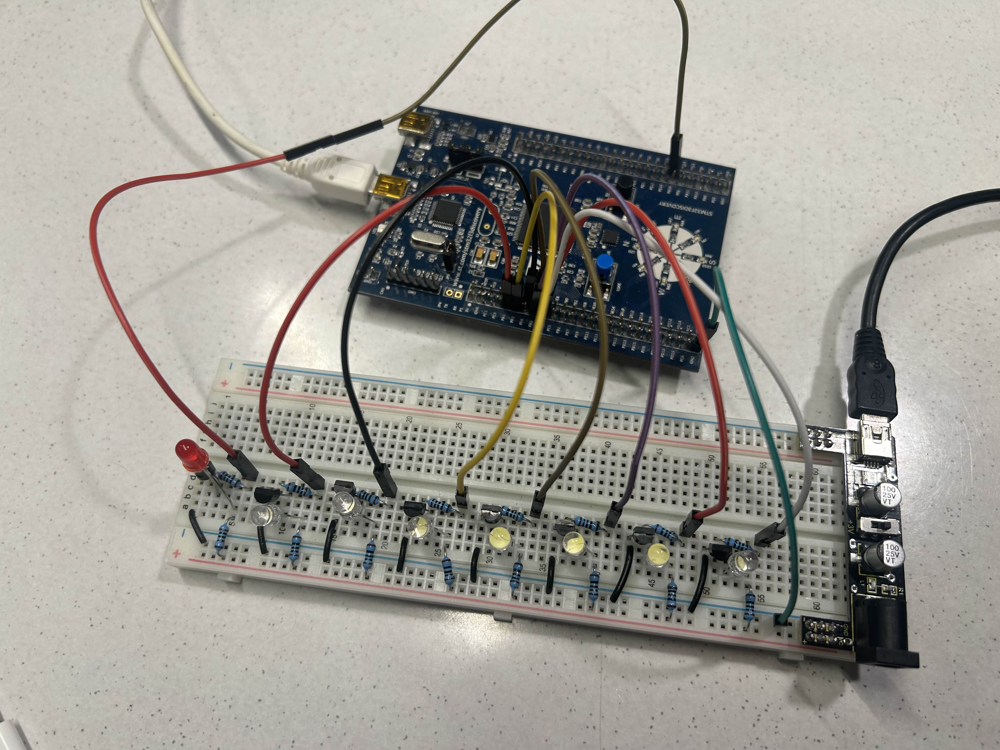

# MTRX2700 Treasure Hunt Training – Group 3

## Semester
**S1 2025** – The University of Sydney  
**Unit:** MTRX2700 – Mechatronics 2

---

## 🔧 Project Description

This project implements a multi-stage **embedded escape room** using **STM32F3 Discovery Boards**, with each board acting as a unique challenge. Inspired by **Indiana Jones** and **arcade-style games**, users must solve a series of five interactive puzzles to advance through “doors” and reach the final challenge. All systems were developed in **modular C** using **STM32CubeIDE**.

---

## 🧑‍💻 Group Members & Roles

| Name        | Role                        | Responsibilities                                                                                  |
|-------------|-----------------------------|---------------------------------------------------------------------------------------------------|
| Oscar       | Timer Game & Serial Comm    | Designed LED chase minigame with levels and serial UART feedback   |
| Marco       | Gyroscope Compass Lead      | Built IMU compass module with calibration, filtering, and directional feedback via STM32 LEDs     |
| James       | Riddle & Morse Code Lead    | Created interactive riddle and Morse code system using PWM buzzer output and GUI planning         |
| Ben         | Pressure Sensor Developer   | Developed analog pressure plate using voltage divider and ADC interpretation, implement motor     |
| Johnathan   | Memory Game  | Implemented LED/button memory game with modular logic and physical user interface enhancements     |

---

## 🗂️ Challenge Overview

| Challenge         | Description                                                                 |
|-------------------|-----------------------------------------------------------------------------|
| Memory Game       | Repeat LED/button sequences across levels with increasing difficulty        |
| Timer Game        | Stop a moving LED on a target; failure triggers buzzer |
| Pressure Plate    | Simulate idol-swap puzzle using a weighted sensor plate and motor feedback |
| Compass Navigation| Guide player toward North using gyroscope/magnetometer heading detection    |
| Morse Code Riddle | Decode a PWM buzzer message to unlock the final clue or instruction         |

## Challenge 1 and 2

### UART Messaging Protocol

This project uses UART to communicate between the STM32 microcontroller and a Python-based GUI which is ran locally on the device using vscode. The controller sends  messages to the GUI, which the GUI then displays in a organised and themed manner. The GUI can respond to user interaction either through the microntroller and UART or inputs directly into the GUI in the form of answers.

#### Message Structure

- **Each message** is an array of strings, sent line by line
- **Lines** are terminated with standard line endings (`\r`, `\r\n`)
- **Blank lines** are transmitted as `\r\n` to create visual spacing in the GUI
- **End of message** is  (`~`) at the end of the final line

#### Example C Implementation

```c
// Example function to send the intro message over UART
void print_intro(void) {
    const char *message_lines[] = {
        "Welcome to Treasure Hunter Training!",
        // ... lines omitted for brevity ...
        "Press the blue button to begin your journey!~"  // End marker
    };

    for (int i = 0; i < sizeof(message_lines) / sizeof(message_lines[0]); i++) {
        const char *line = message_lines[i];
        const char *to_send = (line[0] == '\0') ? "\r\n" : line;

        for (int j = 0; j < strlen(to_send); j++) {
            while (!(USART1->ISR & USART_ISR_TXE)); // Wait until TX buffer is empty
            USART1->TDR = to_send[j];
        }
        while (!(USART1->ISR & USART_ISR_TC));  // Wait until transmission complete
    }
```
#### How Button Presses Are Checked

- At the start, the code selects a random target LED (between 1 and 7) and flashes it briefly. The player needs to remember which LED was the target.
- The game then cycles the white LEDs, lighting them up one at a time from left to right and back again.
- When the player presses the button, the `stop_chase` flag is set. This is usually done inside a button interrupt.
- The program checks which LED was last lit before the button press (this value is stored as `final_led`).
    - If `final_led` matches the target LED chosen at the beginning, the player wins the round. The game continues to the next stage or resets as needed.
    - If `final_led` does not match the target, the red LED (or possibly a buzzer, depending on configuration) flashes on and off three times to indicate failure.
- After either outcome, the game resets so another attempt can be made.
- Missing the correct timing or remembering the wrong LED will result in the failure indication.

The logic is straightforward but can be challenging depending on the speed and attention of the player.

### Breadboard Setup

The breadboard configuration uses 7 white LEDs and 1 red LED, each controlled via separate GPIO pins on the STM32 microcontroller:

- **White LEDs (PA1–PA7):**
  - Each white LED is connected to an individual STM32 GPIO pin (PA1 through PA7).
  - Each LED is wired in series with its own resistor and NPN transistor.
  - The PAx pin (where x = 1–7) provides a small current to the transistor base, allowing a larger current to flow from the breadboard’s VCC rail, through the resistor and LED, then to ground.
  - This configuration offloads LED current from the microcontroller, preventing excessive draw on the STM32’s pins.

- **Red LED (PA15 – Morse Code Output):**
  - The red LED is set up similarly, using a resistor and NPN transistor.
  - It is connected to PA15, which is mapped to the TIM2 timer peripheral for PWM or precise Morse code signaling in the code.
  - Again, the transistor switches current from the VCC supply through the LED and resistor to ground, triggered by the PA15 pin.

**Why transistors?**  
The STM32 can’t safely supply enough current to power multiple LEDs directly. Transistors act as switches, letting the board’s power rail supply the required current while only a small control signal is needed from the microcontroller.

**Wiring summary:**
- Each PAx pin → 100Ω resistor (base) → NPN transistor base.
- Collector: VCC (after passing through ~100Ω current-limiting resistor and LED).
- Emitter: Ground.
- 
#### Example Breadboard Setup

Below is a photo of the actual breadboard wiring for this project:



---

## ⚙️ Software Architecture

- **Modular C** code (`.c/.h` files) with clear separation
- **Interrupt-driven UART** and **timers**
- **Function pointer callbacks** for modularity
- **Peripheral setup** (GPIO, ADC, PWM, I2C/SPI as needed)
- **Command parsing** via serial interface
- **3D-printed props** and physical interfaces for interactivity

---

## 🧪 Testing Plan

| Module             | Test Description                              | Method                                 | Expected Result                        | Status |
|--------------------|-----------------------------------------------|----------------------------------------|----------------------------------------|--------|
| Memory        | LED/button sequence validation                | Repeat correct pattern                 | Player progresses/fails appropriately  | ✅     |
| Timer Game         | LED stop timing and feedback                  | Button press at correct moment         | UART and LED indicate result           | ✅     |
| Pressure Plate     | Weight change detection                       | Swap object on plate                   | LED/motor response triggered           | ✅     |
| Compass            | Heading accuracy and stability                | Rotate board, track direction          | Accurate feedback toward North         | ✅     |
| Morse Code         | Buzzer playback and decode timing             | Listen and interpret Morse code        | Player identifies correct answer       | ✅     |

---

## 🖥️ Getting Started

### Requirements

- STM32F3 Discovery Boards (x6)
- STM32CubeIDE
- USB cables
- Serial terminal (Cutecom / PuTTY)
- Breadboards, resistors, buttons, buzzer, sensors, LEDs, transistors, op-amp

### Build Instructions

1. Clone this repository.
2. Import challenge folders into STM32CubeIDE (`File > Import > Existing Projects`).
3. Build and flash code to STM32 boards.
4. Open a serial terminal (115200 baud) and interact with each challenge.

---

## 🏁 Integration and Flow

Players must **complete each puzzle** to progress through a sequence of five “doors.”  
Each module acts as one level. Upon solving a puzzle, the system:
- Provides success/failure feedback (LED, buzzer, motor)
- Sends or triggers the next challenge (via UART or external signal)

The storyline culminates in a **final pressure plate challenge**.

---

## ✅ Assessment Checklist

- [x] Modular `.c/.h` code structure
- [x] Fully working challenge boards
- [x] Interrupt-driven UART and timers
- [x] Physical puzzle interfaces
- [x] 3D-printed components used
- [x] Clean version-controlled repo
- [x] All features tested and documented
- [x] README includes updated roles and structure

---

